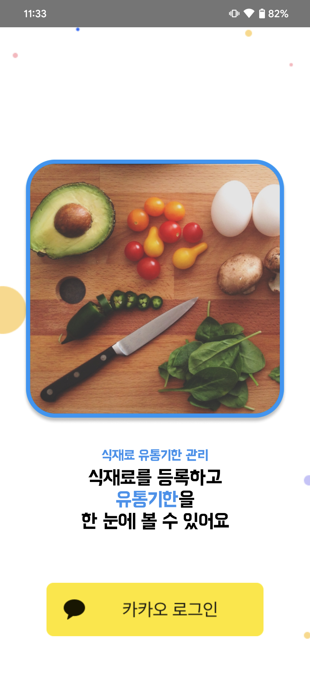
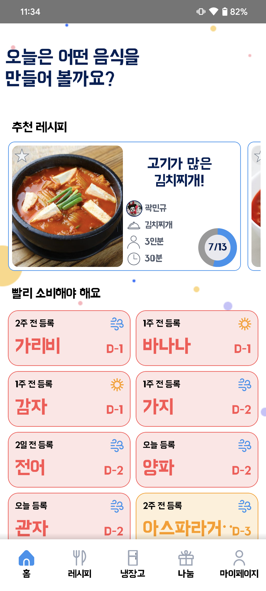
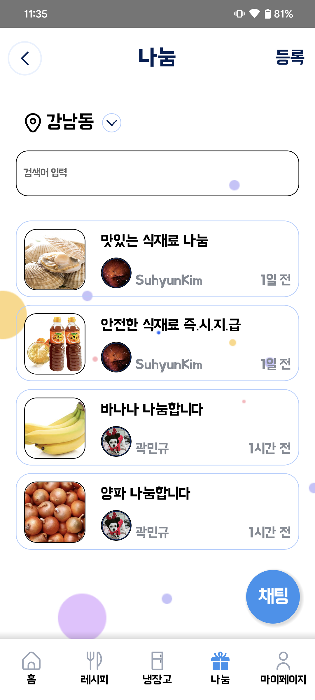
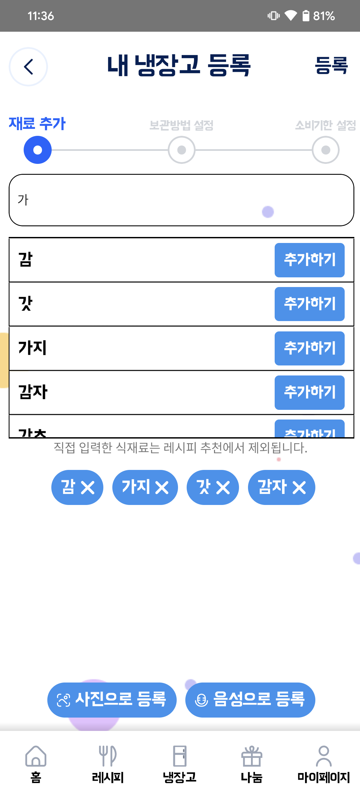

## SSAFY 9기 특화 프로젝트
# 좋은 냉장고, 신선한 나눔 - 좋냉신나
- 냉장고 식자재 관리 및 나눔 서비스 
- [apk 다운로드](https://1drv.ms/u/s!AkrJpxi-ZmutiPNutUjyN42GvDJ0_A?e=c2RFwU)

## 팀원 소개

| NAME   | ROLE    | EMAIL                |
| ------ | ---- | -------------------- |
| 김석주 | Leader, Backend   | tjrwn1247@naver.com  |
| 김수현 | Backend    | ppsracchriskim@gmail.com |
| 곽민규 | Frontend, Backend    | tngks1995@naver.com |
| 금세현 | Backend, BlockChain    | shkum0330@gmail.com |
| 왕준영 | Backend, Infra   |  wangsun7@naver.com  |
| 윤태영 | Frontend    | yyytae0@gmail.com   |

## 기획 배경
### 1. 기존 냉장고 관리 어플리케이션의 한계
- 기존의 냉장고 관리 어플리케이션은 식재료 등록이 번거롭고, 적절한 활용처를 제공해주지 않음
### 2. 여러 명이 한 냉장고를 사용할 때의 어려움
- 가구 구성원끼리 냉장고를 공유하는 경우 정확한 식재료 파악이 어려움
### 3. 소비 패턴의 변화와 그에 따른 식재료 폐기 증가
- 가구 구성원 수가 줄어들고 배달 문화가 발달하면서, 소비기한 내에 먹지 못하고 폐기되는 식재료의 양이 증가함

## 기능
### 레시피 추천 & 소비기한 임박 재료 알림

### 레시피 상세 검색

### 남는 식재료 나눔

### 식재료 자동완성/OCR/STT 일괄 등록

## 개발 환경 및 IDE
### FrontEnd
> 

### BackEnd
> 

### BlockChain
> 

### Infra
> 

### Development Tool

### Communication Tool
> 

## 설계 및 산출물
* [요구사항 정의서](https://www.notion.so/b5cda16927484ff18de603dc57afffab?pvs=4)
* [와이어 프레임](https://www.figma.com/file/Zbq5uxPolrcGTBqj0YG5mu/%ED%99%98%EA%B2%BD%EB%B3%B4%ED%98%B8%EB%B2%94?type=design&node-id=0%3A1&mode=design&t=awZIiBr4fW0UVzbh-1)
* [ER 다이어그램](https://www.erdcloud.com/d/Qj7WevNawY3xH7A6c)
* [Git 컨벤션](https://www.notion.so/Git-Convention-31914546aa48442a8029846da66f6e53?pvs=4)
* [Jira 컨벤션](https://www.notion.so/Jira-Convention-9c3867d7c3be4498a53076b61ffee740?pvs=4)
* [API 명세서 및 역할 분담](https://www.notion.so/API-cf4ac4b5bff54b09afc6dc7027fa9fee?pvs=4)
* [트랜잭션 플로우](https://www.notion.so/1f517b2def874d26be277dbb7f783f2c?pvs=4)
* [시스템 아키텍처](https://www.notion.so/1c8235f7857a4776863019086fa9a8b7?pvs=4)
