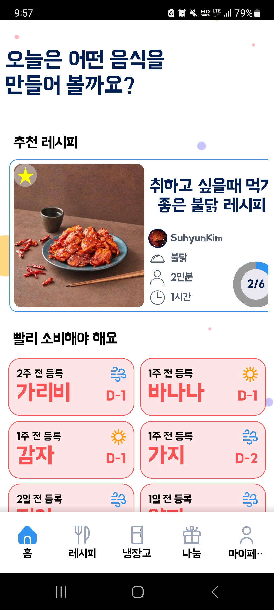
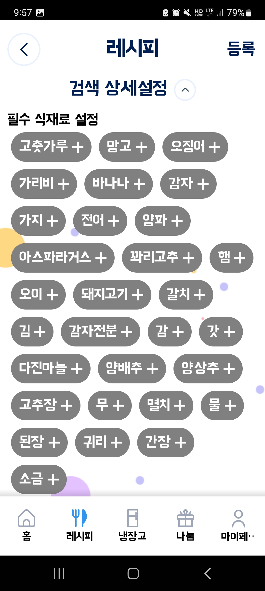
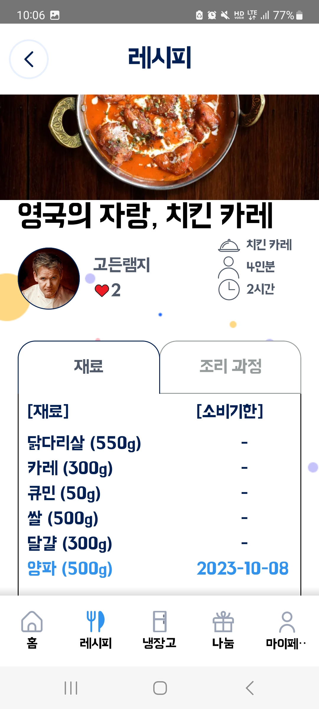
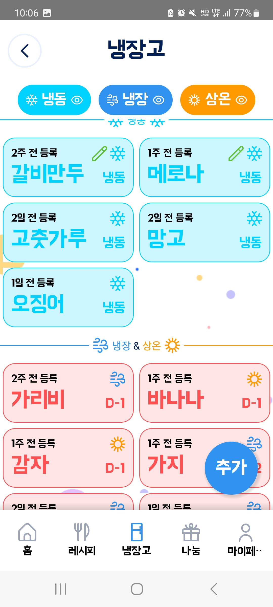
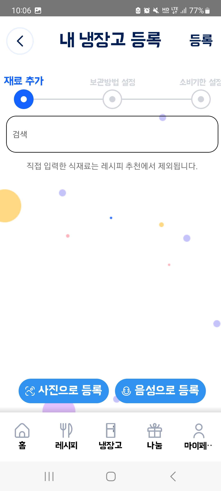
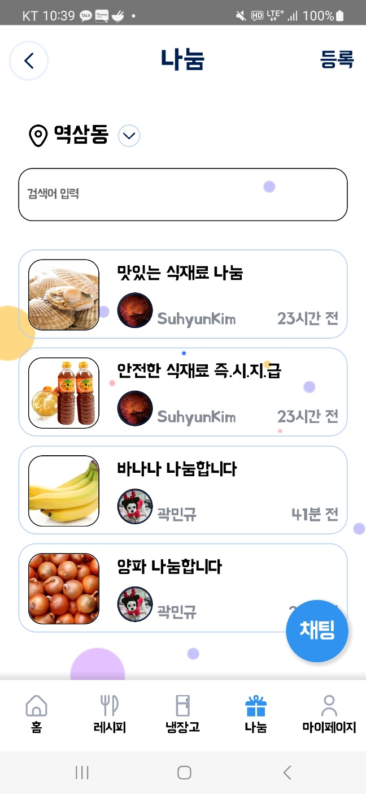

# 시나리오 문서

## 1. 홈화면

### * 추천 레시피
사용자가 가지고 있는 재고 기준으로 만들 수 있는 레시피를 추천해줌.

### * 소비기한 임박 재료 목록
소비기한이 5일 이내인 재료를 가장 임박한 재료부터 순서대로 표시되어 있음. 재료명 우측에는 보관방법과 남은 소비기한이 포함되어 있음. 

## 2. 레시피

### * 레시피 박스
레시피 박스의 좌측에는 레시피 즐겨찾기 용 별과 좌측에 레시피 썸네일, 우측에는 위부터 레시피 제목, 레시피 등록인, 메뉴 이름, 양과 조리시간을 순서대로 표시한다. 

### * 상세 레시피 이동
레시피 박스를 선택하면 해당 레시피의 상세페이지로 이동

### * 레시피 즐겨찾기
레시피 박스의 좌측상단에 별을 누르면 즐겨찾기 활성화/해제를 할 수 있다. 색이 들어온 상태가 현재 즐겨찾기 한 것이고 색이 들어오지 않은 상태가 즐겨찾기 하지 않은 것이다. 

## 3. 레시피 검색 설정

화면의 '검색 상세 설정' 탭 우측의 화살표를 누른다. 

### * 필수 식재료 설정
현재 재고의 재료가 회색으로 표시되고 '+'버튼을 누르면 해당 재료가 파란색으로 바뀌며 필수 식재료로 등록된다.

### * 제외 식재료 설정
'마이페이지'의 제외 식재료가 기본으로 표시되고 검색탭을 눌러 검색을 통해 제외 식재료를 검색할 수 있다. 해당 식재료가 검색 탭 밑에 일치하는 결과가 있다면 그 결과의 옆에 있는 추가하기 버튼으로 추가할 수 있다. 성공적으로 추가되면 밑의 제외 식재료가 나열된 목록에 추가된다. 

### * 없는 재료 개수 제한
레시피 재료 중 현재 재고에 없는 재료 개수의 상한선을 스크롤로 정할 수 있다. 

### * 검색 탭
가장 하단의 검색 탭을 통해 위의 설정이 적용되어 있고 해당 문자열이 포함된 레시피를 검색할 수 있다. 

## 4. 레시피 상세 페이지

위부터 차례로 레시피 썸네일, 레시피 제목과 레시피 목록의 레시피 박스에 포함된 내용들이 표시되어 있고 그 밑에는 재료와 조리과정을 탭으로 선택하여 확인할 수 있는 박스가 있다. 

### * 재료 탭
재료 칸에는 재료 이름과 필요한 재료양이 표시되어 있다. 만일 해당 재료가 재고에 존재하는 경우 하늘색으로 표시되고 해당 재룡의 소비기한이 우측에 같이 표시된다. 

### * 조리과정 탭
해당 탭에는 조리과정이 순서대로 표시된다. 

## 5. 냉장고

상단에는 현재 재료를 관리하는 형태인 냉동/냉장/상온 탭이 표시되어 있으며 눌러서 해당 관리 형태의 식재료를 표시하거나 표시하지 않을 수 있다. 색이 들어와 있다면 해당 관리 형태로 보관 중인 식재료가 하단에 표시되며 색이 들어와 있지 않다면 하단에 표시되지 않는다. 

하단에는 냉동 칸과 냉장 및 상온 칸으로 나누어 표시되며 해당 식재료 박스의 아이콘을 통해 현재 보관형태를 파악할 수 있다. 식재료는 소비기한이 얼마 남지 않은 식재료부터 나열되어 있으며 소비기한이 3일 내로 남은 식재료는 빨간색으로 5일 내로 남은 식재료는 노란색 그 외는 초록색으로 표시된다. 

### * 추가
냉장고 페이지 우측 하단에는 추가 버튼이 있어 냉장고 식재료 등록 페이지로 이동하여 추가 식재료 등록을 진행할 수 있다. 

### * 식재료 박스
식재료 박스에는 해당 식재료가 등록된 시점과 해당 식재료의 이름, 남은 소비기한, 보관 형태가 표시되어 있다. 특히 해당 식재료의 소비기한이 얼마 남았는지에 따라 빨간색, 노란색, 초록색으로 표시된다. 보관 형태가 냉동인 경우 파란색으로 표시되며 따로 소비기한도 표시되지 않고 '냉동'으로 표기된다. 

해당 박스를 터치하면 식재료 이름, 보관방법, 등록시기와 함께 해당 식재료의 보관 방법 및 소비기한을 수정할 수 있는 수정하기 버튼과 해당 식재료를 삭제할 수 있는 삭제하기 버튼이 모달로 표시된다. 

## 6. 냉장고 식재료 등록

냉장고 식재료 등록은 3가지 단계인 재료 추가/보관방법 설정/소비기한 설정 탭이 상단에 표시되고 해당 진행도를 확인할 수 있다. 

### * 재료 추가 단계
재료 추가 단계에서는 검색 탭을 통해 수동으로 식재료를 등록할 수 있다. 검색 탭 하단에는 자동완성 기능이 구현되어 있어 원하는 식재료와 일치하는 식재료를 우측의 추가하기 버튼으로 추가할 수 있다. 수동으로 등록하는 방법외에도 영수증 사진같은 것을 등록하여 식재료를 등록할 수 있는 '사진으로 등록' 버튼과 음성으로 식재료를 등록할 수 있는 '음성으로 등록' 버튼이 있다. 

### * 보관방법 설정
재료 추가 단계에서 추가된 식재료의 보관방법을 수정할 수 있는 단계이다. 초기에는 모두 냉장으로 표시되어 있으며 실온/냉동 탭을 클릭하여 냉장으로 표기된 식재료의 보관방법을 각각 실온, 냉동으로 바꿀 수 있다. 식재료의 보관방법을 수정하는 것은 해당 식재료를 클릭하면 위의 탭으로 이동하게 된다. 

### * 소비기한 설정
앞에서 냉장/상온으로 표기된 재료들이 달력 밑에 표시되며 달력에서 식재료의 소비기한을 먼저 선택한 후, 소비기한에 해당하는 식재료를 클릭하여 식재료의 소비기한을 설정할 수 있다. 

## 7. 나눔 페이지

상단에는 현재 나눔을 받고자 하는 지역이 표시되고 하단에는 그 지역의 나눔목록을 표시한다. 그 밑의 검색 탭에는  해당 지역의 나눔 목록 중 해당 문자열을 포함하는 나눔 목록을 하단에 표시한다. 

### * 나눔 박스
해당 나눔 박스에는 나눔의 썸네일, 제목, 글쓴이와 등록 시점을 표시한다. 해당 박스를 클릭하면 나눔 상세 페이지로 이동하며 밑의 나눔 예약으로 해당 글쓴이와 나눔 약속을 잡을 수 있다. 

### * 채팅
우측 하단에는 파란색 원형의 채팅 버튼이 있어 내가 참여한 나눔 채팅 목록을 표시해준다. 